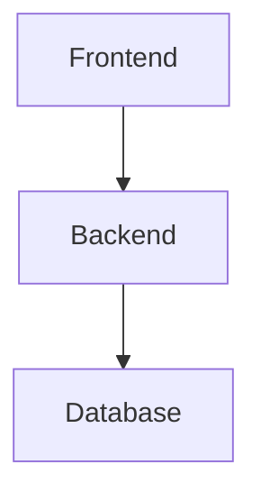
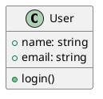
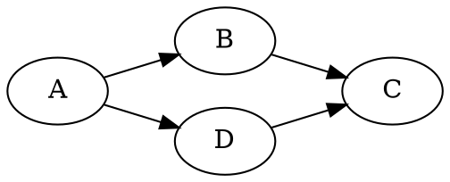
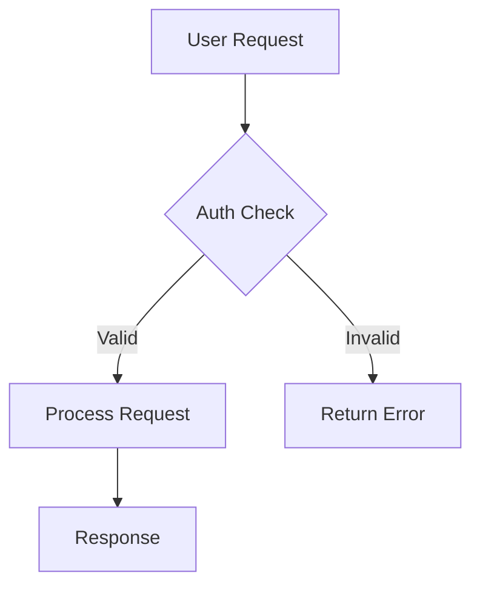

# Markdown Workflow

[](https://github.com/nickhart/markdown-workflow/actions/workflows/ci.yml)
[](https://github.com/nickhart/markdown-workflow/actions/workflows/ci.yml)
[](https://nodejs.org/)
[](https://pnpm.io/)
[](https://turbo.build/)
[](https://www.typescriptlang.org/)
[](https://opensource.org/licenses/MIT)

A TypeScript-based workflow system for managing document templates and collections. Automate your job applications, blog posts, and other document workflows with customizable templates and status tracking.

**Status:** v1.0.0 Release Candidate - Job application and presentation workflows are fully functional and tested.

## 🎯 What It Does

Transform this manual process:

1. Copy-paste resume template
2. Manually fill in company/role details
3. Customize cover letter for each application
4. Keep track of application status in spreadsheet
5. Generate formatted documents for submission

Into this automated workflow:

```bash
wf create job "Google" "Staff Engineer" --url "https://job-posting-url"
# edit 'job/active/google_staff_engineer_20241125/cover_letter.md'
wf format job google_staff_engineer_20241125  # Generates DOCX files
# submit job application with DOCX files in 'job/active/google_staff_engineer_20241125/formatted'
wf status job google_staff_engineer_20241125 submitted
```

And if you're using Git to track your repository (recommended!) you can commit changes to your repo as you go.

## ✅ Current Features

### Core Workflow System

- 📝 **Template-driven document generation** - Mustache templates with variable substitution
- 🔄 **Status tracking** - Move collections through workflow stages (active → submitted → interview → offered)
- 📁 **Project-specific customization** - Override templates and workflows per project
- 🌐 **Web scraping** - Automatically fetch job descriptions from URLs
- 📦 **Modular document processing** - Pluggable processors for different content types (Mermaid, PlantUML, Emoji)
- 🔧 **Smart converters** - Workflow-specific processing (clean documents for jobs, rich diagrams for presentations)
- 🔧 **Repository-agnostic** - Works from any directory, like git

### Job Application Workflow (Fully Implemented)

- **Create applications:** `wf create job "Company" "Role"`
- **Track status:** `wf status job collection_id submitted`
- **List applications:** `wf list job` or `wf list job active`
- **Add notes:** `wf add job collection_id notes recruiter`
- **Format documents:** `wf format job collection_id`
- **Update metadata:** `wf update job collection_id --url "https://new-url"`
- **Migration tool:** `wf migrate` (from legacy bash-based system)

### Presentation Workflow (New!)

- **Create presentations:** `wf create presentation "My Presentation Title"`
- **Multi-engine diagrams:** Automatic processing of Mermaid, PlantUML, and Graphviz code blocks
- **Rich formatting:** Convert to PPTX with embedded diagrams
- **Status tracking:** Draft → review → published
- **Asset management:** Auto-generated images in `assets/` directory

Example diagram blocks:

**Mermaid (flowcharts, sequence diagrams):**

````markdown

````

**PlantUML (UML diagrams):**

````markdown

````

**Graphviz (network graphs, decision trees):**

````markdown

````

### Template System

- **Inheritance:** Project templates override system defaults
- **Variables:** `{{user.name}}`, `{{company}}`, `{{role}}`, `{{date}}`, etc.
- **Multiple variants:** Default, mobile-focused, frontend-specific templates
- **Flexible:** Add your own templates and variables

### Processor System

- **Modular Processing:** Each workflow specifies which processors to use
- **Job Applications:** Clean documents with emoji processing only
- **Presentations:** Rich diagrams with multiple diagram engines and emoji support
- **Extensible:** Add custom processors for your specific needs

Available processors:

- 🧩 **Mermaid** - Generate flowcharts, sequence diagrams, and more from code blocks
- 🌱 **PlantUML** - Create UML diagrams, activity diagrams, and flowcharts
- 📊 **Graphviz** - Generate professional network graphs, decision trees, and complex diagrams
- 😀 **Emoji** - Convert shortcodes to Unicode emoji (`:rocket:` → 🚀)
- 🔌 **Custom** - Build your own processors for specialized content

## 🚀 Quick Start

### Prerequisites

#### macOS (Homebrew)

```bash
# Install all dependencies at once
brew bundle

# Or install individually
brew install node pnpm pandoc graphviz plantuml wget
```

#### Manual Installation

**Required:**
- Node.js 20+ - [nodejs.org](https://nodejs.org/)
- pnpm 10+ - `npm install -g pnpm`
- pandoc - [pandoc.org](https://pandoc.org/installing.html)

**Optional (for diagram processing):**
- graphviz - For Graphviz processor ([graphviz.org](https://graphviz.org/download/))
- plantuml - For PlantUML processor ([plantuml.com](https://plantuml.com/download))
- wget - For web scraping (fallback to curl if not available)
- @mermaid-js/mermaid-cli - Installed automatically via npm

### Installation

**Option 1: Development Setup**

```bash
git clone https://github.com/yourusername/markdown-workflow.git
cd markdown-workflow
pnpm install
turbo cli:build

# CLI is now available at dist/cli/index.js
# Use with: node dist/cli/index.js <command>
```

**Option 2: Global Installation (Recommended)**

```bash
./setup.sh  # Creates global 'wf' command
```

### Initialize Your First Project

```bash
# Navigate to your project directory
cd ~/my-job-search

# Initialize with job workflow
wf init

# Edit your configuration
nano .markdown-workflow/config.yml
```

Sample configuration:

```yaml
user:
  name: 'John Doe'
  preferred_name: 'john_doe'
  email: 'john@example.com'
  phone: '(555) 123-4567'
  city: 'San Francisco'
  state: 'CA'
  linkedin: 'linkedin.com/in/johndoe'
  github: 'github.com/johndoe'
```

### Create Your First Job Application

```bash
# Create a new job application
wf create job "Google" "Software Engineer"

# With URL scraping
wf create job "Meta" "Senior SWE" --url "https://job-posting-url"

# Check what was created
wf list job
ls .markdown-workflow/collections/job/active/
```

This creates:

- `resume_john_doe.md` - Your resume tailored for this role
- `cover_letter_john_doe.md` - Customized cover letter
- `collection.yml` - Metadata and status tracking
- `job_description.html` - Scraped job posting (if URL provided)

### Track Your Application Through the Process

```bash
# Update status
wf status job google_software_engineer_20241125 submitted

# Add interview notes
wf add job google_software_engineer_20241125 notes recruiter
wf add job google_software_engineer_20241125 notes technical

# Generate formatted documents for submission
wf format job google_software_engineer_20241125

# Check formatted output
ls .markdown-workflow/collections/job/submitted/google_software_engineer_20241125/formatted/
```

## 📚 Complete Command Reference

### Project Management

```bash
wf init                    # Initialize project with default workflows
wf init --force           # Force initialization (overwrites existing)
```

### Collection Management

```bash
# Create new collections
wf create job "Company" "Role"
wf create job "Stripe" "Staff Engineer" --url "https://job-url"

# List collections
wf list job                # All job applications
wf list job active         # Only active applications
wf list job --format json  # JSON output

# Update status
wf status job collection_id submitted
wf status job collection_id interview
wf status job collection_id offered
wf status job collection_id rejected

# Add items to existing collections
wf add job collection_id notes recruiter
wf add job collection_id notes technical
wf add job collection_id notes panel

# Update collection metadata
wf update job collection_id --url "https://new-job-url"
```

### Document Generation

```bash
# Format to DOCX (default)
wf format job collection_id

# Format to specific format
wf format job collection_id --format pdf
wf format job collection_id --format html
```

### Diagram Processing

The system supports three powerful diagram engines for different use cases:

#### 🧩 Mermaid - Interactive Diagrams

Best for: flowcharts, sequence diagrams, Gantt charts, mindmaps

````markdown

````

````

**Supported diagram types:** flowchart, sequence, gantt, pie, journey, gitgraph, mindmap, timeline

#### 🌱 PlantUML - Professional UML

Best for: class diagrams, activity diagrams, use case diagrams, component diagrams

```markdown

```plantuml:auth-sequence
@startuml
User -> AuthService: login(credentials)
AuthService -> Database: validateUser()
Database --> AuthService: userInfo
AuthService --> User: token
@enduml
````

````

**Supported diagram types:** class, sequence, usecase, activity, component, state, object, deployment

#### 📊 Graphviz - Technical Graphs

Best for: network topologies, decision trees, dependency graphs, org charts

```markdown
```graphviz:dependency-graph {layout=dot}
digraph Dependencies {
    rankdir=LR;
    node [shape=box];

    Frontend -> API;
    API -> Database;
    API -> Cache;
    Frontend -> CDN;
}
````

````

**Layout engines:** dot (hierarchical), neato (spring), fdp (force-directed), circo (circular), twopi (radial)

### Emoji Processing

The emoji processor converts shortcodes like `:rocket:` to Unicode emoji 🚀. It uses GitHub's standard emoji names with convenient aliases for frequently used emojis.

**Examples:**

```markdown
Looking forward to working at DoorDash :takeout_box:!
This project is :fire: and I'm :thumbsup: about it!
More info available here :information_source:
````

**Naming Convention:**

- **GitHub Standard Names** (preferred): `:rocket:`, `:fire:`, `:thumbsup:`, `:takeout_box:`
- **Convenient Aliases**: `:thumbs_up:` (alias for `:thumbsup:`), `:info:` (alias for `:information_source:`)

The processor supports 100+ emojis covering tech, food, emotions, and professional contexts. For the complete list, see the [GitHub Emoji API](https://api.github.com/emojis).

### Migration & Utilities

```bash
wf migrate                 # Migrate from legacy bash-based system
wf --help                  # Show available commands
wf create --help           # Command-specific help
```


## 🏗️ Architecture

```text
src/
├── engine/        # Core workflow engine and environment abstraction
├── services/      # Business logic services (orchestration, collection mgmt, processors)
├── cli/           # Command-line interface implementation
└── utils/         # Shared utilities and helper functions

workflows/         # Default workflow definitions
├── job/           # Job application workflow + templates
├── presentation/  # Presentation workflow + templates
└── blog/          # Blog workflow + templates

tests/             # Comprehensive test suite
├── unit/          # Unit tests with mocked filesystems
├── integration/   # Integration tests
└── e2e/           # End-to-end snapshot tests
```

## 🎨 Customization

### Override Templates

Create `.markdown-workflow/workflows/job/templates/` in your project:

```text
.markdown-workflow/
├── config.yml
├── workflows/
│   └── job/
│       └── templates/
│           ├── resume/
│           │   ├── default.md      # Your custom resume
│           │   └── technical.md    # Tech-focused variant
│           └── cover_letter/
│               └── default.md      # Your custom cover letter
└── collections/
    └── job/                        # Generated applications
```

### Template Variables

Available in all templates:

- `{{user.*}}` - All user config fields (name, email, phone, etc.)
- `{{company}}` - Target company name
- `{{role}}` - Position title
- `{{date}}` - Current date
- `{{collection_id}}` - Unique collection identifier

### Workflow Status Flow

```text
active → submitted → interview → offered → accepted
   ↓         ↓          ↓          ↓     ↳   ↓
rejected  rejected   rejected   rejected  declined
```

## 🧪 Development

### Local Development

```bash
pnpm install                    # Install dependencies
turbo cli:build                 # Build CLI (cached with TurboRepo)
turbo test                      # Run unit tests
turbo test:e2e:snapshots        # Run E2E snapshot tests
```

### Quality Assurance Commands

```bash
# Quick validation (essential checks only)
turbo preflight                 # Build + unit tests + lint + format check

# Comprehensive validation (includes E2E tests)
turbo preflight:full            # Build + unit tests + lint + format check + E2E snapshots

# Individual quality checks
turbo lint                      # ESLint code quality
turbo format:check              # Prettier formatting check
turbo format                    # Auto-fix formatting issues
```

### Testing

- **Unit tests:** Comprehensive mocking with in-memory filesystems
- **E2E tests:** Snapshot-based regression testing with real CLI operations
- **Fast builds:** TurboRepo caching makes rebuilds instant

## 🔮 Roadmap

### v1.1.0 - Enhanced Blog Workflow

- Enhanced blog workflow features
- Publishing and content management
- Rich media processing and optimization

### v1.2.0 - Workflow Extensions

- Plugin system for custom processors
- Template marketplace
- Advanced customization options

### v2.0.0 - Collaboration Features

- Workflow distribution and sharing
- Community workflow repository
- Team collaboration tools

## 📖 Documentation

- **[Release Plan](docs/RELEASE_PLAN.md)** - v1.0 release roadmap
- **[ADR 002: Simplicity Over Completeness](docs/adr/002-simplicity-over-completeness.md)** - Core design philosophy
- **[Testing Guide](docs/testing-mock-filesystems.md)** - Comprehensive testing documentation
- **[Blog Post Ideas](docs/blog-notes.md)** - Development story and collaboration insights

## 🤖 AI Code Review

Get AI-powered code reviews on your pull requests using Claude:

### How to Use

**Trigger a review** by commenting on any PR:

```
/claude-review
```

**Available options**:

```bash
/claude-review                    # Standard review with Haiku model
/claude-review --model sonnet     # Use Claude 3.5 Sonnet (more thorough, higher cost)
/claude-review --brief           # Concise feedback only
/claude-review --focus security  # Focus on specific areas (security, performance, maintainability, typescript)
```

### What to Expect

- **Status tracking**: Watch for 👀 → ✅ reactions and labels
- **Review focus**: Security issues, logic bugs, TypeScript best practices, maintainability
- **Cost**: ~$0.001-0.01 per review (Haiku), ~$0.02-0.05 per review (Sonnet)
- **Non-blocking**: Reviews never prevent PR merging

### Review Labels

- 🏷️ `ai-reviewing` - Review in progress
- 🏷️ `ai-reviewed` - Review completed successfully
- 🏷️ `ai-error` - Review failed (check comments for details)

## 🤝 Contributing

1. Fork the repository
2. Create a feature branch
3. Add tests for new functionality
4. Run quality checks: `turbo preflight:full` (includes all tests, linting, and formatting)
5. Submit a pull request
6. _Optional_: Request AI review with `/claude-review` for additional feedback

## 📄 License

MIT License - see [LICENSE](LICENSE) file for details.

---

**Built with TypeScript, tested thoroughly, designed for simplicity.**
