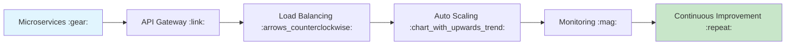
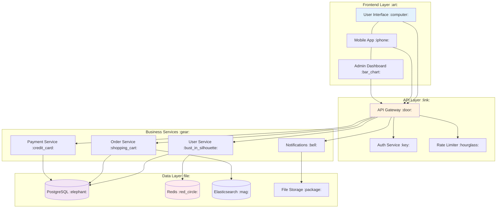
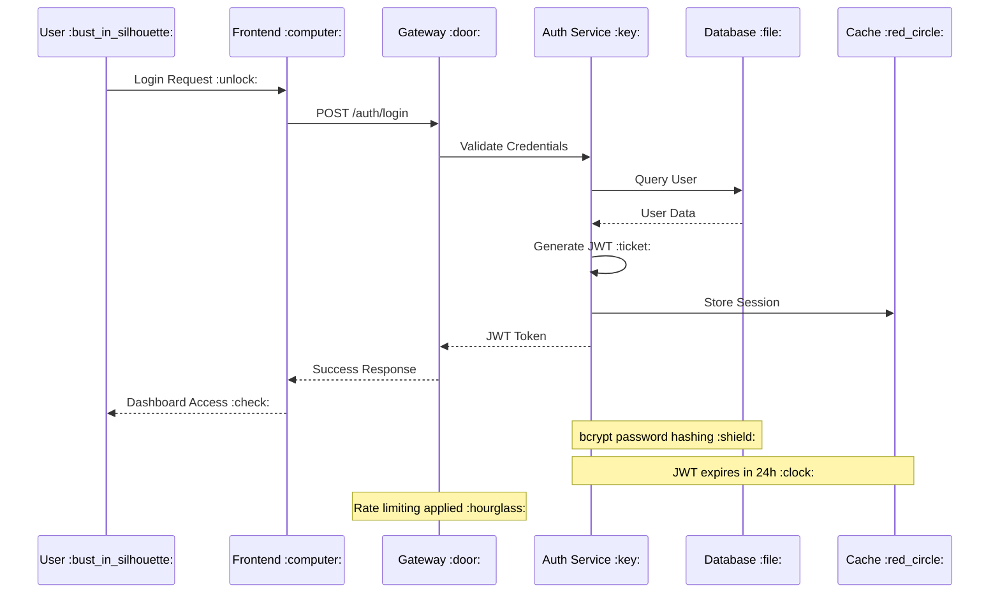

# System Architecture Overview :rocket:

## Introduction :wave:

Welcome to our comprehensive system architecture overview! :fire:

This presentation demonstrates the **Markdown Workflow** processor system with:
- :gear: **Mermaid diagrams** for visual architecture
- :heart: **Emoji processing** for engaging presentations  
- :bulb: **Advanced formatting** capabilities

---

## Challenge :warning:

Building scalable, maintainable systems that handle:
- High traffic loads :chart_with_upwards_trend:
- Real-time processing :zap:
- Data consistency :balance_scale:
- Security requirements :shield:

---

## Our Solution :rocket:

A modern, cloud-native architecture designed for scale and reliability! :trophy:

---

## System Components :computer:

:::columns
:::column
Our platform consists of several key layers:

**Frontend** :art:
- React-based UI
- Mobile apps
- Real-time updates

**API Gateway** :link:
- Request routing
- Authentication
- Rate limiting

**Services** :gear:
- User management
- Order processing  
- Payment handling
- Notifications

**Data** :file:
- PostgreSQL primary
- Redis caching
- Elasticsearch search

:::
:::column

:::
:::

---

## Authentication Flow :key:

Security features:
- :shield: Password hashing with bcrypt
- :ticket: JWT-based authentication  
- :hourglass: Rate limiting on login attempts
- :clock: Automatic session expiry

---

## Performance Metrics :chart_with_upwards_trend:

Our system delivers excellent performance:

| Metric | Current | Target | Status |
|--------|---------|---------|--------|
| Uptime | 99.95% | 99.9% | :green_heart: |
| Response Time | 85ms | <100ms | :green_heart: |
| Throughput | 5,000 req/sec | 3,000 req/sec | :green_heart: |
| Error Rate | 0.02% | <0.1% | :green_heart: |

:trophy: **Achievements**:
- Zero downtime deployments
- Sub-second database queries
- 24/7 automated monitoring

### Next Steps :world_map:

1. :construction: **Q3 2025**: Service mesh implementation
2. :rocket: **Q4 2025**: AI-powered auto-scaling  
3. :star: **2026**: Edge computing rollout

---

## Thank You! :heart:

Questions and discussion welcome! :speech_balloon:

**Contact**: John Smith  
:email: john.smith@example.com  
:github: github.com/johnsmith  
:linkedin: linkedin.com/in/johnsmith

---

*This presentation was created with the new Markdown Workflow processor system, featuring:*

:gear: **Mermaid diagrams** - automatically converted to images  
:heart: **Emoji processing** - shortcodes converted to Unicode  
:art: **Advanced formatting** - with multiple concurrent processors

*Try it yourself at* :link: **github.com/yourusername/markdown-workflow** :rocket:
