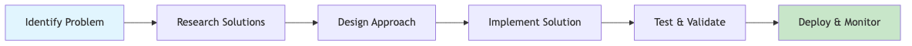

# Test Default

## Overview

Brief introduction to your presentation topic.

---

## Problem Statement

Describe the challenge or opportunity you're addressing.

---

## Solution Overview

{align=center, width=80%, layout=horizontal}

High-level approach to solving the problem.

---

## Technical Architecture

::: columns
::: column
System components and their relationships.
:::

::: column
{ width=80% }
:::
:::

---

## Implementation Details

### Key Features

- Feature 1: Description
- Feature 2: Description
- Feature 3: Description

### Technical Stack

- Frontend: Technology choice
- Backend: Technology choice
- Database: Technology choice

---

## Results & Impact

### Metrics

- Metric 1: Improvement
- Metric 2: Improvement
- Metric 3: Improvement

### Next Steps

1. Future enhancement 1
2. Future enhancement 2
3. Future enhancement 3

---

## Questions & Discussion

**Contact:** <your.email@example.com>
**Date:** Thursday, July 31, 2025
