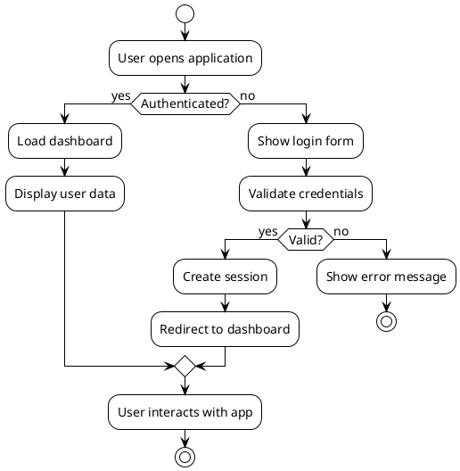
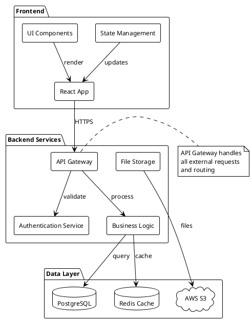
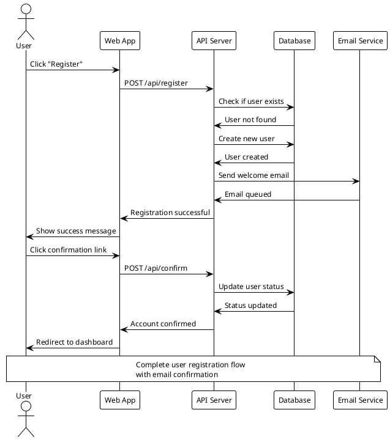
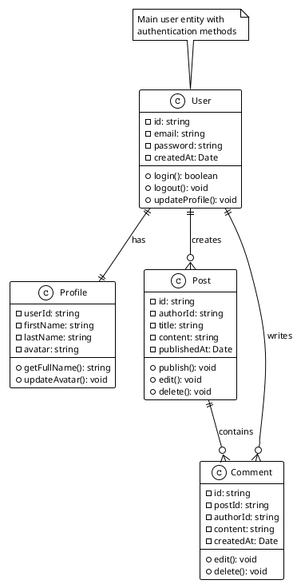
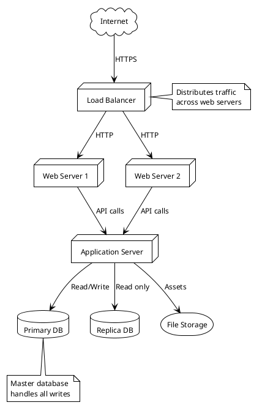

# {{title}}

Welcome to markdown-workflow presentations! This beginner template shows you all the essential features for creating professional technical presentations.

---

## Getting Started

This presentation demonstrates:

- **Simple slide layouts** with markdown
- **PlantUML diagrams** for technical content
- **Professional formatting** with reference templates
- **Multiple output formats** (PPTX, HTML, PDF)

Let's explore each feature step by step.

---

## Basic Slide Elements

### Text Formatting

You can use standard markdown formatting:

- **Bold text** for emphasis
- _Italic text_ for subtle emphasis
- `Code snippets` for technical terms
- [Links](https://example.com) for references

### Lists and Structure

1. **Ordered lists** for step-by-step content
2. **Bullet points** for feature lists
3. **Nested items** for detailed breakdowns
   - Sub-item A
   - Sub-item B
   - Sub-item C

---

## Simple Flow Diagrams

Perfect for showing processes and decision flows:



This diagram shows a typical user authentication flow.

---

## System Architecture Diagrams

Great for showing how components interact:



---

## Sequence Diagrams

Perfect for showing interactions over time:



---

## Class Diagrams

Show object relationships and structure:



---

## Two-Column Layouts

For comparing concepts or showing before/after:

:::: {.columns}
::: {.column width="50%"}

### Before Implementation

- Manual processes
- Email-based workflows
- Spreadsheet tracking
- No real-time updates
- Limited collaboration

**Problems:**

- Data inconsistency
- Process delays
- Human errors
  :::

::: {.column width="50%"}

### After Implementation

- Automated workflows
- Real-time notifications
- Centralized dashboard
- Live collaboration
- Audit trails

**Benefits:**

- 90% faster processing
- Zero data entry errors
- Complete visibility
  :::
  ::::

---

## Code Examples

You can include code snippets with syntax highlighting:

```typescript
// Example API endpoint
export async function createPresentation(title: string, template: string): Promise<Presentation> {
  const collection = await workflowEngine.createCollection('presentation', { title, template });

  // Generate diagrams
  await plantumProcessor.processMarkdown(collection.content, collection.assetsDir);

  return {
    id: collection.id,
    title: collection.metadata.title,
    status: collection.metadata.status,
  };
}
```

---

## Network Diagrams

Show infrastructure and connections:



---

## Tips for Great Presentations

### Content Structure

1. **Start with an overview** - Tell them what you'll tell them
2. **Use diagrams liberally** - Pictures are worth 1000 words
3. **Keep slides focused** - One main idea per slide
4. **End with next steps** - Give clear action items

### Technical Diagrams

- **Flow diagrams** for processes and workflows
- **Sequence diagrams** for time-based interactions
- **Class diagrams** for object relationships
- **Architecture diagrams** for system overviews

### Workflow Commands

```bash
# Create new presentation
wf create presentation "My Topic" beginner

# Generate diagrams and slides
wf format presentation my_topic_20250731

# Update status when ready
wf status presentation my_topic_20250731 published

# Commit your work
wf commit presentation my_topic_20250731
```

---

## Next Steps

1. **Customize this template** for your specific content
2. **Add your own diagrams** using PlantUML syntax
3. **Generate PPTX files** with `wf format`
4. **Share and collaborate** using version control

### Resources

- **PlantUML Documentation**: [plantuml.com](https://plantuml.com)
- **Markdown Guide**: Standard markdown syntax
- **Workflow Commands**: Use `wf --help` for all options

---

# Questions?

**Contact:** {{user.email}}  
**Created with:** markdown-workflow  
**Date:** {{date}}

_Thank you for using markdown-workflow presentations!_
