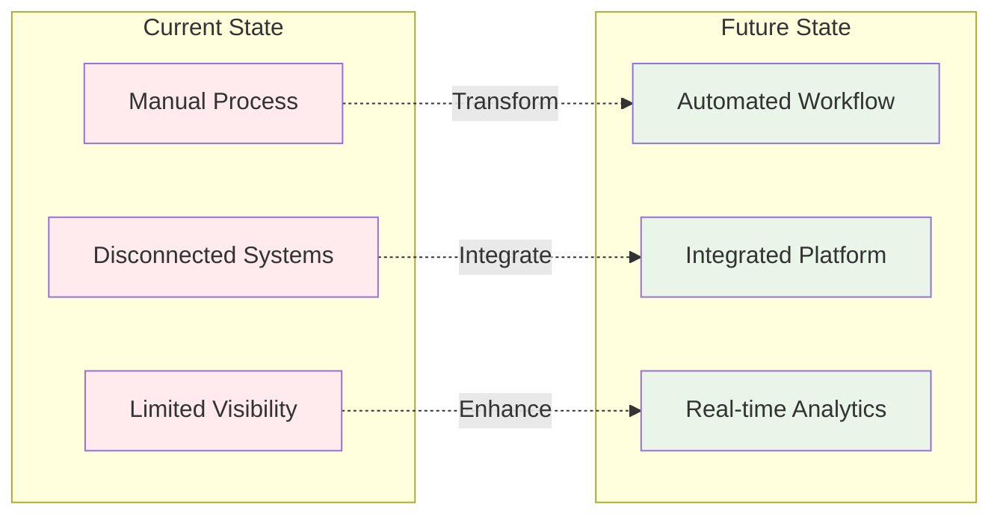
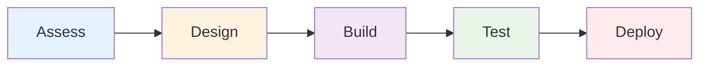
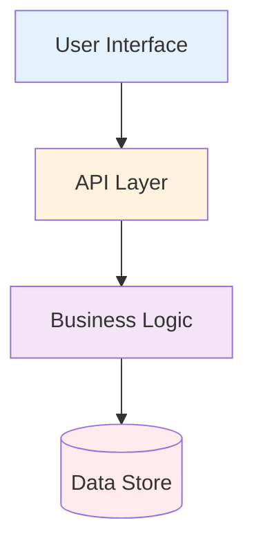

# {{title}}

---

## Executive Summary

**Problem**: Brief problem statement in one sentence.

**Solution**: Concise solution overview in one sentence.

**Impact**: Key business value and expected outcomes.

---

## Current vs Future State

---

## Technical Approach

**Key Components**:

- Assessment: Current state analysis
- Design: Architecture and specifications
- Build: Agile development methodology
- Test: Automated quality assurance
- Deploy: Phased rollout strategy

---

## Architecture

**Stack**: Modern, scalable technology stack with proven components.

---

## Implementation Plan

### Phase 1: Foundation (Weeks 1-4)

- Infrastructure setup
- Core services development
- Security implementation

### Phase 2: Features (Weeks 5-12)

- User interface development
- Integration testing
- Performance optimization

### Phase 3: Launch (Weeks 13-16)

- User acceptance testing
- Production deployment
- Monitoring and support

---

## Expected Outcomes

### Quantitative Benefits

- **Efficiency**: 60% reduction in processing time
- **Cost Savings**: $500K annual operational savings
- **Quality**: 95% reduction in errors

### Qualitative Benefits

- Improved user experience
- Enhanced data visibility
- Streamlined workflows
- Better decision making

---

## Investment & ROI

### Required Investment

- **Development**: $200K (8 months)
- **Infrastructure**: $50K annually
- **Training**: $25K one-time

### Return on Investment

- **Break-even**: 12 months
- **3-year ROI**: 300%
- **Payback period**: 14 months

---

## Risk Mitigation

### Technical Risks

- **Integration complexity**: Phased approach with fallback options
- **Performance concerns**: Load testing and optimization
- **Security vulnerabilities**: Regular audits and updates

### Business Risks

- **User adoption**: Change management and training program
- **Budget overrun**: Agile methodology with regular checkpoints
- **Timeline delays**: Buffer time and parallel workstreams

---

## Success Metrics & KPIs

### Performance Indicators

- System uptime: >99.5%
- User satisfaction: >4.5/5
- Process efficiency: 60% improvement
- Error rate: <1%

### Business Metrics

- Cost reduction: $500K annually
- User adoption: 80% within 6 months
- Training completion: 95% of users
- Support tickets: <50% of baseline

---

## Next Steps

### Immediate Actions

1. **Stakeholder approval** - Executive sign-off on proposal
2. **Team formation** - Assemble development and project teams
3. **Kickoff meeting** - Project initiation and planning session

### Follow-up Items

- Technical deep-dive sessions
- Vendor selection (if applicable)
- Resource allocation confirmation
- Detailed project schedule

---

## Questions & Approval

**Recommendation**: Proceed with project based on strong business case and manageable technical risks.

**Decision Required**: Executive approval to move forward with implementation.

**Contact**: {{user.email}} | **Date**: {{date}}
