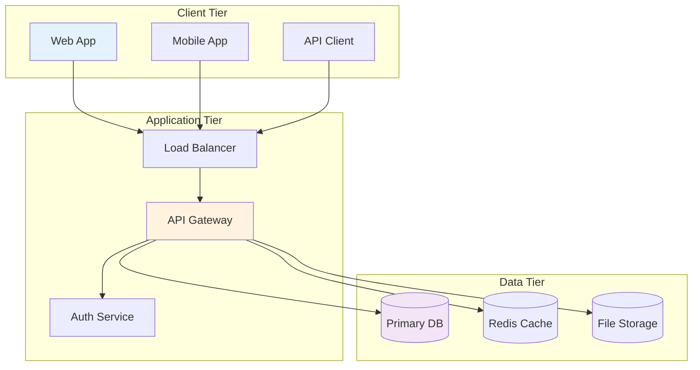
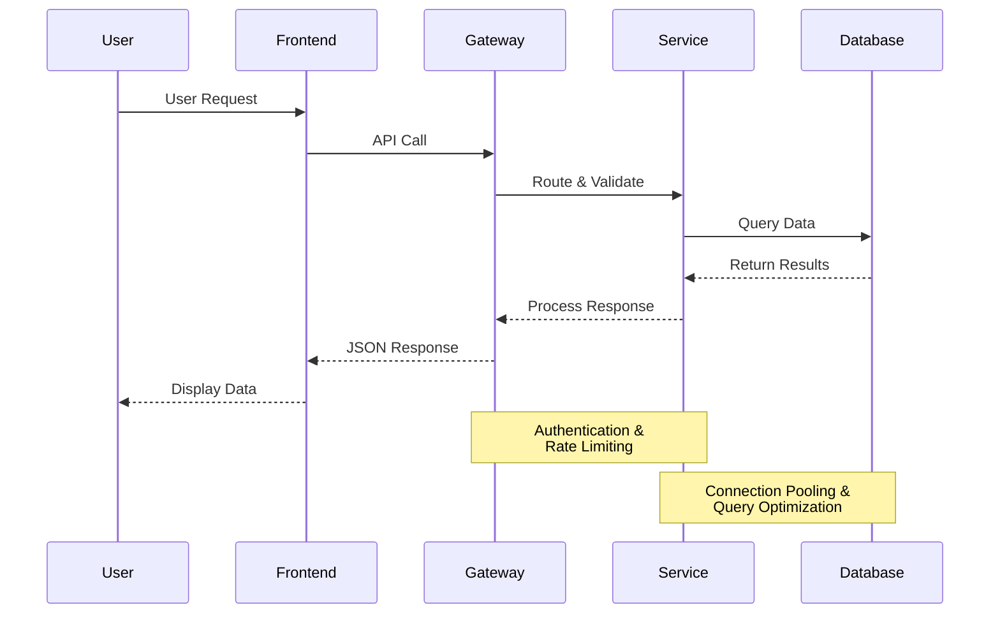
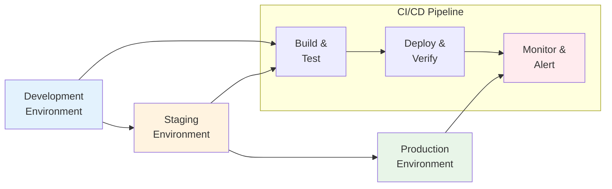

# {{title}}

## Overview

Brief introduction optimized for clear slide layout.

---

## Problem Statement

Describe the challenge with concise, bulleted points:

- **Key Issue 1**: Brief description
- **Key Issue 2**: Brief description
- **Key Issue 3**: Brief description

---

## Solution Overview

```mermaid:solution-overview {align=center, width=1000px, layout=horizontal}
flowchart LR
    A[Problem<br/>Analysis] --> B[Solution<br/>Design]
    B --> C[Implementation<br/>Planning]
    C --> D[Development<br/>Execution]
    D --> E[Testing &<br/>Validation]
    E --> F[Production<br/>Deployment]

    style A fill:#ffebee
    style C fill:#e3f2fd
    style E fill:#f3e5f5
    style F fill:#e8f5e8
```

**Approach**: Systematic problem-solving methodology ensuring thorough analysis, robust design, and reliable deployment.

---

## Architecture Overview



**Key Components**: Three-tier architecture with clear separation of concerns and horizontal scalability.

---

## Data Flow Diagram



**Flow**: Optimized request processing with built-in security and performance considerations.

---

## Implementation Details

### Core Features

- **Scalable Architecture**: Microservices with container orchestration
- **Security First**: OAuth 2.0, JWT tokens, encrypted communications
- **Performance Optimized**: Caching layers, connection pooling, CDN integration

### Technology Stack

- **Frontend**: React/TypeScript, responsive design
- **Backend**: Node.js/Express, RESTful APIs
- **Database**: PostgreSQL with Redis caching
- **Infrastructure**: Docker, Kubernetes, AWS/Azure

---

## Deployment Strategy



**Strategy**: Automated CI/CD with comprehensive testing and monitoring at each stage.

---

## Results & Metrics

### Performance Targets

- **Response Time**: < 200ms average API response
- **Availability**: 99.9% uptime SLA
- **Throughput**: 10,000+ concurrent users

### Success Metrics

- **User Engagement**: 40% increase in daily active users
- **System Reliability**: 99.95% actual uptime achieved
- **Development Velocity**: 50% faster feature delivery

---

## Next Steps & Timeline

### Immediate Actions (Week 1-2)

1. **Environment Setup**: Development and staging infrastructure
2. **Team Onboarding**: Technical training and documentation
3. **Sprint Planning**: Feature prioritization and backlog grooming

### Short-term Goals (Month 1-3)

1. **MVP Development**: Core functionality implementation
2. **Testing Framework**: Automated test suite establishment
3. **Security Audit**: Penetration testing and vulnerability assessment

---

## Questions & Discussion

### Key Discussion Points

- Architecture review and feedback
- Resource allocation and timeline validation
- Risk mitigation strategies
- Success criteria and KPIs

**Contact:** {{user.email}}  
**Project Lead:** {{user.name}}  
**Review Date:** {{date}}
