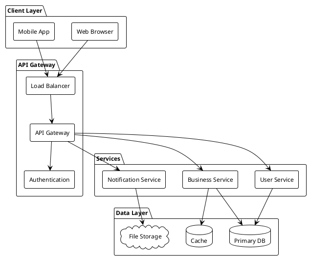
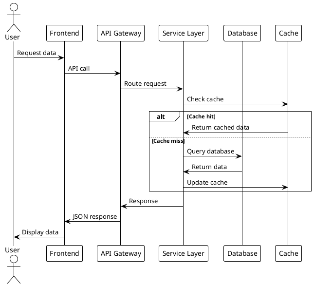
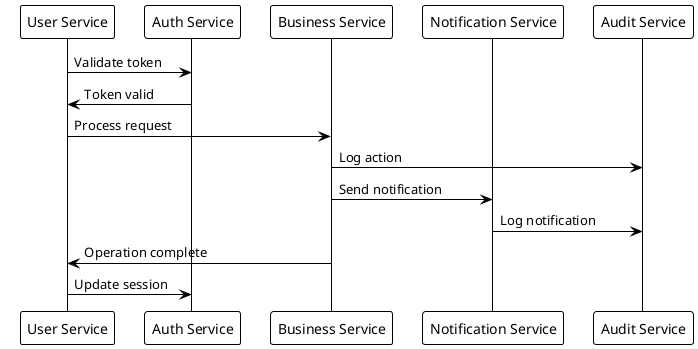
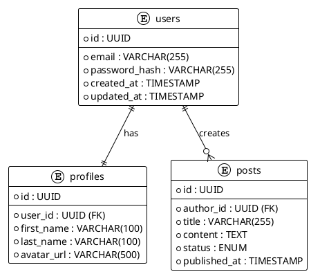
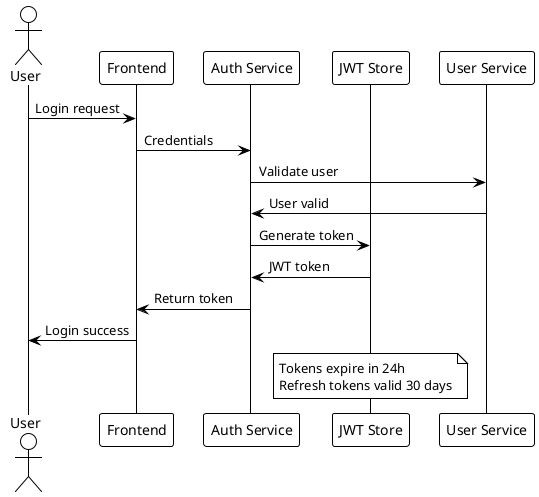
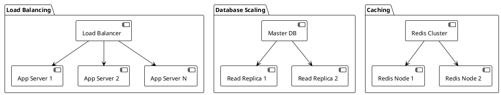
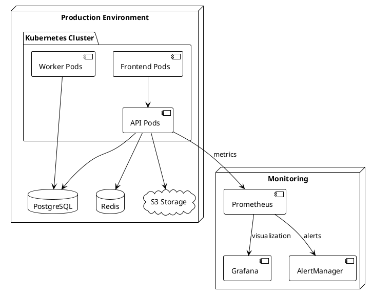
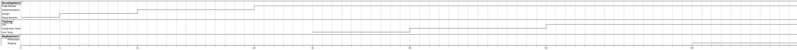

# {{title}}

Technical deep-dive and architectural overview.

---

## System Overview

### Current State

Brief description of existing system or baseline.

### Proposed Changes

Key improvements and modifications being introduced.

---

## Architecture Diagram

---

## Data Flow

---

## Service Interactions

---

## Database Schema

---

## Security Model

### Authentication Flow

### Authorization Matrix

| Role  | Read Users | Create Posts | Admin Panel |
| ----- | ---------- | ------------ | ----------- |
| Guest | ❌         | ❌           | ❌          |
| User  | ✅         | ✅           | ❌          |
| Admin | ✅         | ✅           | ✅          |

---

## Performance Considerations

### Caching Strategy

- **L1 Cache**: In-memory application cache (5 min TTL)
- **L2 Cache**: Redis distributed cache (1 hour TTL)
- **CDN**: Static assets cached globally (24 hours)

### Scalability Patterns

---

## Deployment Architecture

---

## Migration Strategy

### Phase 1: Infrastructure

- Set up new environments
- Migrate core services
- Establish monitoring

### Phase 2: Data Migration

- Export existing data
- Transform and validate
- Import to new system

### Phase 3: Cutover

- Blue-green deployment
- Traffic switching
- Rollback plan ready

---

## Monitoring & Observability

### Key Metrics

- **Availability**: 99.9% uptime SLA
- **Performance**: < 200ms API response time
- **Throughput**: 10,000 requests/minute capacity

### Alerting Rules

- High error rate (> 5%)
- Slow response time (> 500ms)
- Database connection issues
- Memory usage > 80%

---

## Risk Assessment

| Risk             | Impact | Probability | Mitigation                  |
| ---------------- | ------ | ----------- | --------------------------- |
| Database failure | High   | Low         | Read replicas, backups      |
| Service overload | Medium | Medium      | Auto-scaling, rate limiting |
| Security breach  | High   | Low         | OAuth, encryption, auditing |

---

## Implementation Timeline

---

## Questions & Next Steps

### Discussion Points

1. Architecture review and feedback
2. Performance requirements validation
3. Security concerns and compliance
4. Timeline and resource allocation

### Action Items

- [ ] Finalize technical specifications
- [ ] Set up development environments
- [ ] Begin implementation sprints
- [ ] Schedule regular architecture reviews

---

**Contact:** {{user.email}}  
**Architecture Review Date:** {{date}}  
**Version:** 1.0
